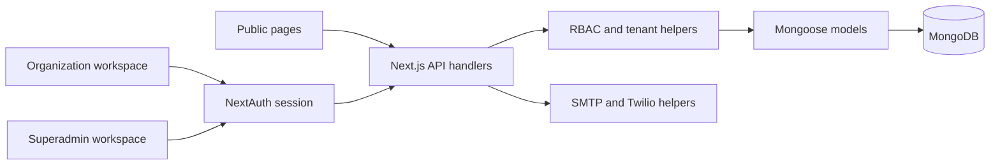

# SaveMAX software knowledge

Source assessment: 18 September 2026. This is the technical handover for **System**, separate from the lead-research **Brain** in the sibling directory.

## What we know and what we do not

The generated [inventory](INVENTORY.md) maps 229 source/config files, 73 page routes, 72 API route files and 23 Mongoose model files. It includes the public APIs omitted by the current code graph's directory exclusions. [inventory.json](inventory.json) provides the same snapshot for tooling.

Inventory coverage is not 100% behavioral knowledge. Core authentication, tenancy, property access, public booking, contracts, payments and notification paths were inspected. Every route is indexed, but not every handler has received a semantic security review. Runtime behavior, actual database configuration, role combinations, concurrency and external delivery remain separate verification work. Do not describe the application as fully audited or production-ready based on this document.

## Architecture

SaveMAX is a Next.js App Router application containing React pages and server API handlers in one application. Mongoose connects to MongoDB; NextAuth credentials authentication supplies sessions. Tailwind styles the interface; Recharts provides charts. The package manifest declares Next 16, React 19, Mongoose 9 and NextAuth 5 beta. Consult the lockfile for installed versions.

The diagram describes intended layering; individual handlers do not consistently enforce all guards. See [GAPS.md](GAPS.md).

Entry points: [root layout](file:///D:/ROCRE/softwares/Savemax/System/app/layout.tsx), [client shell](file:///D:/ROCRE/softwares/Savemax/System/app/ClientLayout.tsx), [middleware](file:///D:/ROCRE/softwares/Savemax/System/middleware.ts), [authentication](file:///D:/ROCRE/softwares/Savemax/System/auth.ts), [database connection](file:///D:/ROCRE/softwares/Savemax/System/lib/mongodb.ts), [permissions](file:///D:/ROCRE/softwares/Savemax/System/lib/rbac.ts), [tenancy](file:///D:/ROCRE/softwares/Savemax/System/lib/tenant.ts).

## Product surfaces

| Area | Scope | Main source |
|---|---|---|
| Public website | Current homepage is a branded frontend-team placeholder; login, organization registration and individual property/unit detail pages exist. A complete public browse frontend is still pending. | [Landing](file:///D:/ROCRE/softwares/Savemax/System/app/(landing)/page.tsx) |
| Platform administration | Organizations, subscriptions, global users, SaaS settings, website content and root profile | [Superadmin](file:///D:/ROCRE/softwares/Savemax/System/app/superadmin/page.tsx) |
| Property operations | Properties, units, amenities, agents and owners | [Properties](file:///D:/ROCRE/softwares/Savemax/System/app/properties/page.tsx) |
| Customer operations | Customers, bookings, inquiries, contracts, customer dashboard and maintenance | [Bookings](file:///D:/ROCRE/softwares/Savemax/System/app/bookings/page.tsx) |
| Financial operations | Payments/invoices, deposits, collection, expenses, commissions and financial/rental reports | [Payments](file:///D:/ROCRE/softwares/Savemax/System/app/payments/page.tsx) |
| Organization administration | Users, roles, staff, payroll, suppliers, settings and blogs | [Settings](file:///D:/ROCRE/softwares/Savemax/System/app/settings/page.tsx) |
| AI-labelled tools | Property assistant and AI reports routes exist; provider configuration, grounding and output accuracy require separate validation | [Assistant API](file:///D:/ROCRE/softwares/Savemax/System/app/api/property-assistant/route.ts) |

## Roles and data boundaries

The principal roles are Superadmin, Admin, Agent, Customer and Owner. Organization default roles are created in `lib/tenant.ts`; saved Role documents determine permissions and can differ from defaults. Do not infer access solely from a role's display name.

Permissions include view values `true`, `all`, `own`, `none` and boolean action permissions. Superadmin bypasses normal organization scoping. Organization queries should use `applyTenantFilter`; writes should use server-derived organization identity. The helper currently maps ordinary users without an organization to `organization: null`, which requires review. Authentication, action permission, tenant scoping and ownership are distinct checks.

Credentials authentication compares a bcrypt password hash, checks inactive accounts and suspended organizations at login, and places identity/role information into the session. Profile identity is refreshed from the database in JWT processing. Existing-session revocation and changed role assignment need explicit regression tests; login validation alone does not establish those guarantees.

## Core workflows

1. **Platform setup and onboarding:** setup initializes a root account when no root exists. Public organization registration creates an organization, its default roles and administrator. Inspect failure rollback and concurrent setup before production. Sources: [setup](file:///D:/ROCRE/softwares/Savemax/System/app/api/setup/route.ts), [onboarding](file:///D:/ROCRE/softwares/Savemax/System/app/api/public/organizations/route.ts).
2. **Property and unit management:** properties reference owners, agents and organizations; units have their own model. Property reads use permission/tenant/ownership filtering. Property mutations currently differ and need correction. Sources: [property access](file:///D:/ROCRE/softwares/Savemax/System/lib/property-access.ts), [property handler](file:///D:/ROCRE/softwares/Savemax/System/app/api/properties/[id]/route.ts).
3. **Public booking:** validates property/unit relationship and submitted fields, finds an existing account by email or creates a guest, then creates a booking tied to the property's organization. Email association is not proof of the submitter's identity. Source: [public booking](file:///D:/ROCRE/softwares/Savemax/System/app/api/public/bookings/route.ts).
4. **Contract creation:** creates a contract with owner derived from the property, then changes the unit/property to Sold or Rented. When a unit is supplied, it counts remaining available units before changing the property. These writes are sequential, without an enclosing transaction in this handler. Source: [contracts](file:///D:/ROCRE/softwares/Savemax/System/app/api/contracts/route.ts).
5. **Payment recording:** generates a timezone-based invoice identifier, initializes deposit history, creates a payment and attempts agent commission creation. Commission errors are logged without failing payment creation. This is accounting-record creation, not proof of an online payment gateway settlement. Source: [payments](file:///D:/ROCRE/softwares/Savemax/System/app/api/payments/route.ts).
6. **Notifications:** SMTP/Nodemailer and Twilio helpers load settings through an HTTP settings request, with environment fallbacks. They return false when unavailable or delivery fails. Real delivery and authenticated settings access are unverified. Source: [notifications](file:///D:/ROCRE/softwares/Savemax/System/lib/notifications.ts).

## Data map

The [model inventory](INVENTORY.md#models) lists schema fields and literal references for all 23 models. Organization and Role/User establish identity and tenancy; Property and Unit establish inventory; Booking, Inquiry, Contract and Maintenance represent operations; Payment, Deposit, Commission, Expense and Payroll represent financial records. Staff, Supplier and Customer are separate schema files; do not assume a Customer document and a User account are interchangeable. Settings/SaaSSettings and BlogPost/FAQ/Review provide configuration and content.

Follow the actual schema for nested fields, required values, enums, hooks and indexes. Mongoose references do not by themselves enforce foreign keys, same-organization relationships or deletion cascades.

## Local operation and configuration

The established local arrangement uses Next.js on port 3000 and a MongoDB Docker service on localhost port 27017. This assessment did not restart or verify those processes. The separate Brain interface uses port 4640 and is not the System backend.

Project commands are `npm run dev`, `npm run build`, `npm start` and `npm run lint`; no test script is declared. Use the documented environment variable **names** in the inventory, and keep values in local secret configuration. Do not put passwords, tokens, database exports or private customer records in this documentation.

## Keeping knowledge current

After source changes, run `node scripts/software-inventory.cjs` to refresh the route/model snapshot. Update the workflow descriptions and gap status when behavior changes, and attach the exact verification performed. The generator reads source only and does not connect to the database. Re-index the code graph after substantial changes; supplement it where its exclusions hide public API files.

For the frontend team: start with public routes, the public response privacy gap, and the distinction between `/property/[id]` (public detail) and `/properties` (workspace management). Preserve authentication and workspace routes when replacing the homepage.
